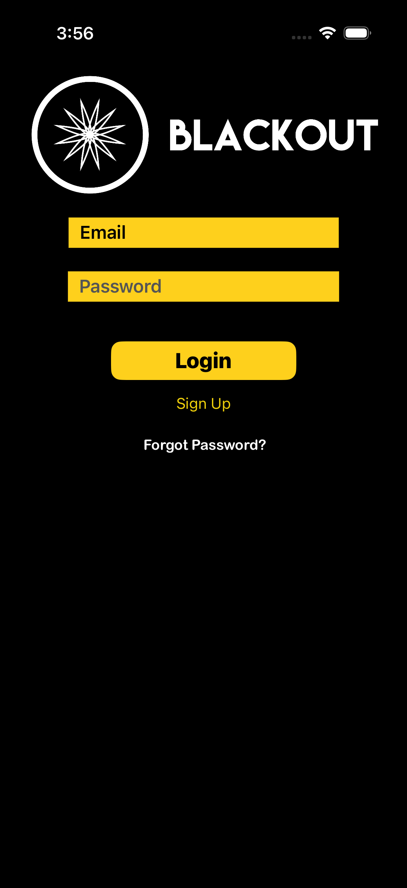
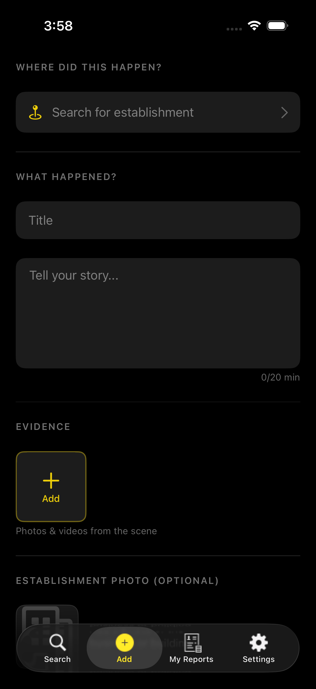
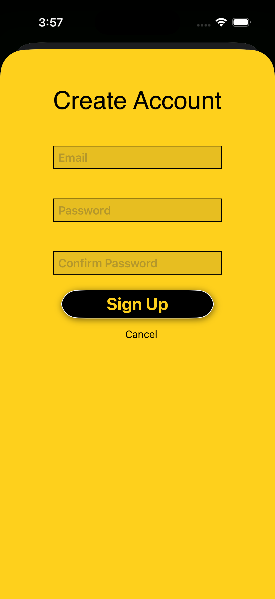

# BlackOut

BlackOut is an iOS application designed to empower consumers by providing a platform to report and share incidents or experiences at businesses. Users can anonymously or with accounts submit reports with descriptions, titles, photos, and videos, search for reports by location, and engage in community discussions through comments and advice with voting systems.

## Features

- **Incident Reporting**: Submit detailed reports about incidents at businesses, including text descriptions, titles, and multimedia attachments (photos and videos).
- **Location-Based Search**: Utilize Google Places API to search and filter reports by business location, city, state, and zip code.
- **User Accounts**: Create accounts using Firebase Authentication for personalized experiences, including viewing your own reports and managing settings.
- **Community Engagement**: Comment on reports, provide advice, and vote on comments to highlight helpful information.
- **Media Handling**: Upload and view images and videos associated with reports using Firebase Storage.
- **Notifications**: Receive push notifications for updates on reports and comments via Firebase Messaging.
- **Moderation**: Block users and report inappropriate content to maintain a safe community.
- **Offline Support**: View cached reports and media when offline.

## Technologies Used

- **Language**: Swift
- **Framework**: UIKit (Storyboard-based UI)
- **Backend**: Firebase (Authentication, Realtime Database, Firestore, Storage, Analytics, Messaging)
- **APIs**: Google Places API for location search
- **Dependencies**:
  - Firebase/Core, Auth, Database, Storage, Firestore, Analytics, Messaging
  - FLAnimatedImage for GIF support
  - DKImagePickerController for media selection
  - Layoutless for UI layout
- **Testing**: XCTest for unit tests, XCUITest for UI tests
- **Build Tool**: CocoaPods for dependency management

## Prerequisites

- macOS with Xcode 15.0 or later
- iOS 15.6 or later
- CocoaPods installed (`sudo gem install cocoapods`)
- Firebase project set up
- Google Places API key

## Installation

1. **Clone the Repository**:
   ```bash
   git clone https://github.com/zthomas99/BlackOut.git
   cd BlackOut
   ```

2. **Install Dependencies**:
   ```bash
   pod install
   ```

3. **Open the Workspace**:
   Open `BlackOut.xcworkspace` in Xcode.

4. **Configure Secrets**:
   - Copy `Secrets.xcconfig.template` to `Secrets.xcconfig`.
   - Add your Firebase configuration and Google Places API key to `Secrets.xcconfig`.
   - Ensure `GoogleService-Info.plist` is present in the `BlackOut` directory (download from Firebase console).

5. **Build and Run**:
   - Select a simulator or connected device.
   - Build and run the project in Xcode.

## Configuration

- **Firebase Setup**:
  - Create a Firebase project at [Firebase Console](https://console.firebase.google.com/).
  - Enable Authentication, Realtime Database, Firestore, Storage, and Messaging.
  - Download `GoogleService-Info.plist` and place it in `BlackOut/`.

- **Google Places API**:
  - Enable Google Places API in Google Cloud Console.
  - Generate an API key and add it to `Secrets.xcconfig` as `GOOGLE_PLACES_API_KEY`.

- **Secrets Configuration**:
  The `Secrets.xcconfig` file should contain:
  ```
  GOOGLE_PLACES_API_KEY = YOUR_API_KEY_HERE
  // Add other secrets as needed
  ```

## Usage

1. **Launch the App**: On first launch, users can sign up or log in.
2. **Search Reports**: Use the search feature to find reports by location or business name.
3. **View Reports**: Browse incident reports with details and media.
4. **Submit a Report**: Tap "Add" to create a new report, attach media, and submit.
5. **Engage with Community**: Comment on reports, provide advice, and vote on helpful comments.
6. **Manage Account**: View your reports, settings, and blocked users in the profile section.

## Testing

- **Unit Tests**: Run `BlackOutTests` target in Xcode.
- **UI Tests**: Run `BlackOutUITests` target in Xcode.

## Contributing

1. Fork the repository.
2. Create a feature branch (`git checkout -b feature/AmazingFeature`).
3. Commit your changes (`git commit -m 'Add some AmazingFeature'`).
4. Push to the branch (`git push origin feature/AmazingFeature`).
5. Open a Pull Request.

## License

This project is proprietary software. All rights reserved by FervorWare.

## Contact

- **Developer**: Zacch Thomas
- **Email**: timonious99@gmail.com
- **GitHub**: [https://github.com/zthomas99/BlackOut](https://github.com/zthomas99/BlackOut)

## Screenshots

## Screenshots

### Login Screen


### Incident Report Submission


### Sign Up


## Version History

- **v2.13.5**: Latest release with bug fixes and improvements.
